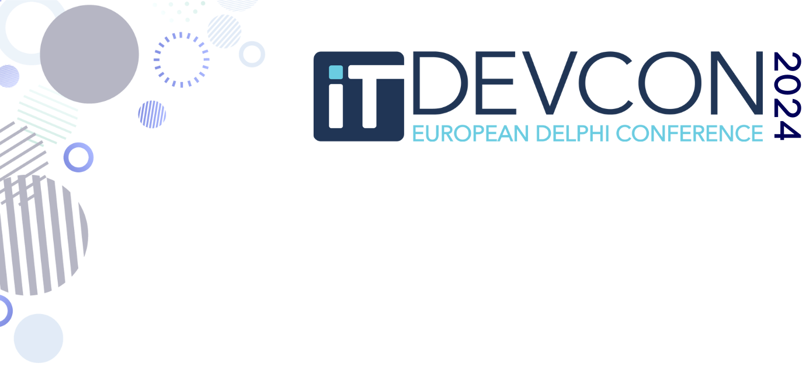

# [If you thought you could do multi-threading, then play "The Deadlock Empire" games](https://www.itdevcon.it/roma/en/sessions/delphi_deadlock_empire/)

This is about a Delphi specific web game focussing on the concurrency issues in multi-threading environments. Each round you play the machine that executes the example code and tries to let it crash in a multi-threading way. Be inventive, think like a bad guy and let the two threads in the sample code deadlock, end up in the same critical section or fail in a debugging assertion.

During the workshop we will play each round interactively: all attendees play the round followed by a short discussion. This is about collective learning, so the speaker will probably learn just as much as attendees do: teaching is learning and learning is teaching.

During the conference you will also get a link to the orginal C# version from which Jeroen derived the Delphi version.

Difficulty level: 2 (intermediate)

The content will be at [delphi_deadlock_empire.md](./delphi_deadlock_empire.md)

