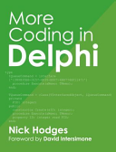

# [Hidden Gems of Delphi Language: Operator Overloading and Class/Record helpers](https://www.itdevcon.it/roma/en/sessions/operator_overloading_in_real_world/)

Abstract:

Originally added to the Delphi .NET compiler, both operator overloading and class/record helpers found themselves into the native Delphi compiler as well.

With Delphi XE3, the helpers were extended to support simple types (like integers and strings) allowing even more flexibility.

This session will show you some examples (from my own, from other people on the internet and from the Delphi RTL, VCL and FireMonkey) demonstrating their power, but also making you aware of limitations.

The Delphi helpers allow you to extend existing Delphi libraries at any place in the inheritance hierarchy without changing the libraries. The operators will allow you to redefine operators for record types allowing for some nifty code.

Some operator overloading examples covered: the underdocumented table of operators you can overload and what each operator does, various kinds of nullable types (integers, floating points), fractions

Some helper examples: adding `for` ... `in` support to various portions of the Delphi run-time libraries, getting the source file name of an `EAssertionFailed`, better casting and a more safe `FreeAndNil` method, adding operators to existing classes

Difficulty level: 2 (intermediate)

---

## Jeroen is back!

I'm back part-time, mainly in the Delphi world.

Feel free to ask me about my health during the session breaks.

---

## Operator overloading and Helpers solve similar problems

Both extend what you can do on types in Delphi

- Operator overloading allows you to use operators beyond native types and variants \*

- Helpers allow to add new behaviour to existing types

Originally, both were needed not because of this, but because of a much simpler reason:

.NET had operator overloading and helpers. Borland wanted to enter the .NET era, therfore Delphi needed them.

\* Variants are evil as they suffer from implicit and undocumented type conversion behaviour from the compiler.

- Variants had a place in back in the < Delphi 2005 days when no better solutions existed.

- Variants now are only useful with COM/OLE interoparability.

---

## Operator overloading

Let's start with the difficult bit now we all are still kind of fresh (:

The first time I needed operator overloading is when I had to perform calculations with values that could be empty.

### Added for .NET

First example was showing operator overloading on classes (more on why the Delphi compiler not allowing this syntax any more) in [New Delphi language features since Delphi 7](https://web.archive.org/web/20230208164908/https://edn.embarcadero.com/article/34324) by [Nick Hodges](https://x.com/nickhodges):

``` Pascal
type
  TMyClass = class
    class operator Add(a, b: TMyClass): TMyClass; // Addition of two operands of type TMyClass
    class operator Subtract(a, b: TMyClass): TMyclass; // Subtraction of type TMyClass
    class operator Implicit(a: Integer): TMyClass; // Implicit conversion of an Integer to type TMyClass
    class operator Implicit(a: TMyClass): Integer; // Implicit conversion of TMyClass to Integer
    class operator Explicit(a: Double): TMyClass; // Explicit conversion of a Double to TMyClass
  end;

// Example implementation of Add class operator 
TMyClass.Add(a, b: TMyClass): TMyClass;
begin
  ...
end;

var
x, y: TMyClassbegin
  x := 12; // Implicit conversion from an Integer 
  y := x + x; // Calls TMyClass.Add(a, b: TMyClass): TMyClass 
  b := b + 100; // Calls TMyClass.Add(b, TMyClass.Implicit(100)) 
end;
```

### My operator overloading needs

The aimed behaviour was very similar to how SQL handles `NULL`:

- all math operators return `NULL` when one of the arguments is `NULL`
  > `1 + NULL` returns `NULL`
  >
  > `NULL + 1` returns `NULL`
  
  The reasoning is that `NULL` means "I don't know", see for instance
  
  [Addition with NULL values](https://stackoverflow.com/questions/1769648/addition-with-null-values) on StackOverflow

- `string` types are an outcast:

  in some SQL dialects a `NULL` string can be or are treated as an empty string

  Examples:
  
  - SQL server [`SET CONCAT_NULL_YIELDS_NULL` (Transact-SQL)](https://learn.microsoft.com/en-us/sql/t-sql/statements/set-concat-null-yields-null-transact-sql)

  - Oracle: [Concatenation Operator](https://docs.oracle.com/en/database/oracle/oracle-database/19/sqlrf/Concatenation-Operator.html)

Luckily the calculations were not using the `string` type (:

---

### Operator overloading only available for records \*

1. An operator is a function returning a function result
2. For classes, the result would be an instance of a class
3. This will give memory management trouble when combining multiple operators in one expression

Example from [Why isn't operator overloading available for classes in Delphi?](https://stackoverflow.com/questions/2090472/why-isnt-operator-overloading-available-for-classes-in-delphi/#2090480) on Stack Overflow:

``` Pascal
myResult := myObject1 + myObject2 + myObject3;
```

This could be solved with limiting operators on classes to the ones implementing interfaces, and limiting the operators for classes to only return interface references.

That's a major undertaking with limited rewards.

---

### \* Yes, in the past some compilers had class operator overloading

The "operators on classes" question returns every once in a while, for instance [Operator Overloading for CLASSES (not records!)](https://www.delphipraxis.net/203202-operator-overloading-classes-not-records.html) on the German Delphi Praxis

---

#### ARC

The ARC compilers did have operator overloading for classes since those compilers had garbage collectors based on [automatic reference counting](https://en.wikipedia.org/wiki/Automatic_reference_counting).

The ARC compilers are phased out for mobile platforms and not available for desktop platforms, see [Directions for ARC Memory Management in Delphi](https://blogs.embarcadero.com/directions-for-arc-memory-management-in-delphi/)

On the other hand: the .NET framework also does reference counting, and VCL.NET could work really well with it.

---

#### .NET

The Delphi .NET compilers did have operator overloading for classes as well (hence the syntax `class operator`).

When [Delphi 2009 replaced Delphi .NET compiler Delphi Prism](https://en.wikipedia.org/wiki/History_of_Delphi_(software)#Codegear_Delphi_2009[3]) - which had a different syntax -
[we all knew](https://stackoverflow.com/questions/2466127/delphi-2010-and-net/2466144#2466144) that Embarcadero would leave the .NET arena.

[They did leave with Delphi XE4.](https://docwiki.embarcadero.com/Support/en/Supported_Versions#:~:text=a%20standalone%20product.-,Embarcadero,-Prism%20and%20Delphi) and left the PHP arena as well.

---

## What about helpers?

These too were introduced for the Delphi .NET compiler

But for a different reason:

> to add Delphi functionality to the .NET types which the Delphi RTL and VCL encapsulated (like `System.Object`)

There is one big limitation: helpers cannot include operators as it generates a compiler error `E2123` or `E2015` (see below)

---

### Cool missing feature: using operator overloading in record helpers \*

From [ein kleines Sprachfeature fehlt: Die Möglichkeit, Operatoren in record helpers überladen zu können](https://www.delphipraxis.net/1453663-post11.html):

``` Pascal
type
  TStringHelper = record helper for string
  public
    class operator In(A: string; B: TStringDynArray): Boolean;
  end;

implementation

class operator TStringHelper.In(A: string; B: TStringDynArray): Boolean;
var
  S: string;
begin
  Result := False;
  for S in B do begin
    if SameStr(A, S) then begin
      Result := True;
      Break;
    end;
  end;
end;

procedure Beispiel;
var
  LString: string;
begin
  LString := 'Foo';
  if LString in ['Foo', 'Bar'] then begin
    // Machwas
  end;
end;
```

Above the `Machwas` line you get an error dependin gon the Delphi version:

- `E2123 PROCEDURE, FUNCTION, PROPERTY, or VAR expected`
- `E2015 Operator not applicable to this operand type`

I forgot at which Delphi version it changes (somewhere between 10.3 and 12.2)

---

## Operator overloading and helpers in the Delphi RTL/VCL/FMX

By now, Delphi itself uses these features quite a bit.

Simple example [System.Types.TPointF.operator Inequality](https://docwiki.embarcadero.com/Libraries/en/System.Types.TPointF) documents only `Subtract`, `Equal` and `NotEqual`, and [System.Types.TPointF.operator Equality](https://docwiki.embarcadero.com/Libraries/Alexandria/en/System.Types.TPointF.operator_Equality) adds `Add`, but the actual code has many more:

``` Pascal
    class operator Add(const APoint1, APoint2: TPointF): TPointF;
    class operator Subtract(const APoint1, APoint2: TPointF): TPointF;
    class operator Equal(const APoint1, APoint2: TPointF): Boolean;
    class operator NotEqual(const APoint1, APoint2: TPointF): Boolean;
    class operator Implicit(const APoint: TPoint): TPointF;
    class operator Negative(const APoint: TPointF): TPointF;
    class operator Multiply(const APoint1, APoint2: TPointF): TPointF;
    class operator Multiply(const APoint: TPointF; const AFactor: Single): TPointF;
    class operator Multiply(const AFactor: Single; const APoint: TPointF): TPointF;
    class operator Divide(const APoint: TPointF; const AFactor: Single): TPointF;
```

Luckily [System.Types.TPointF Methods](https://docwiki.embarcadero.com/Libraries/Alexandria/en/System.Types.TPointF_Methods) - yes operator overloads are a kind of method - shows these.

(demo showing GExperts Grep Search)

---

### Delphi `TValue` example of `implicit` operator

``` Pascal
    // Easy in
    class operator Implicit(const Value: string): TValue;
    class operator Implicit(Value: Integer): TValue;
    class operator Implicit(Value: Cardinal): TValue;
    class operator Implicit(Value: Single): TValue;
    class operator Implicit(Value: Double): TValue;
    class operator Implicit(Value: Extended): TValue;
    class operator Implicit(Value: Currency): TValue;
    class operator Implicit(Value: Int64): TValue;
    class operator Implicit(Value: UInt64): TValue;
    class operator Implicit(Value: TObject): TValue;
    class operator Implicit(Value: TClass): TValue;
    class operator Implicit(Value: Boolean): TValue;
    class operator Implicit(Value: TDateTime): TValue;
    [HPPGen('// NOP')]
    class operator Implicit(Value: TDate): TValue;
    [HPPGen('// NOP')]
    class operator Implicit(Value: TTime): TValue;
    class operator Implicit(const VarRec: TVarRec): TValue; inline;
    class function FromVariant(const Value: Variant; ArrayTypeInfo: PTypeInfo = nil): TValue; static;
    class function From<T>(const Value: T): TValue; inline; static;
    class function FromOrdinal(ATypeInfo: PTypeInfo; AValue: Int64): TValue; static;
    class function FromArray(ArrayTypeInfo: PTypeInfo; const Values: array of TValue): TValue; static;
    class function FromVarRec(const VarRec: TVarRec): TValue; static;
```

## Others on Operator overloading and Helpers

Same here: some code per slide and a summary of the main takeway; each link has the full background information. Sometimes you will need Google Translate

---

### The integer fractions type by Nick Hodges

[Nick Hodges](https://www.nickhodges.com/) wrote [More Coding in Delphi](https://books.google.com/books/about/More_Coding_in_Delphi.html?id=LB37sgEACAAJ) - get that book! *

At page 90 he discusses Operator Overloading, and Page 91 introduced `TFraction` supporting integer fractions.

This sample code is from page 92:

``` Pascal
procedure DoIt;
var
  A, B, C: TFraction;
begin
  A := TFraction.CreateFrom(1, 2); // 1/2
  Writeln (A.ToString());
  B := TFraction.CreateFrom(1, 3); // 1/3
  Writeln (B.ToString());
  C := A + B; // 5/6
  Writeln (C.ToString());
end;
```

An important part of the operator code implementation is calling `Reduced` after each applicable operation.

The book posed this interesting question
[Are Delphi record constructors really needed?](https://stackoverflow.com/questions/42119784/are-delphi-record-constructors-really-needed) on StackOverflow.

---

#### \* Getting the book "More Coding in Delphi" by Nick Hodges:



- Source code for all his books are at https://github.com/NickHodges/NickBookCode since 2020

  (it [used to be](https://bitbucket-archive.softwareheritage.org/projects/ni/NickHodges/codingindelphi.html) [on Bitbucket before that](https://x.com/nickhodges/status/1298567165583544320), but [they killed Mercurial support](https://wiert.wordpress.com/?p=106156))

  including `TFraction` in [`uFractions.pas`](https://github.com/NickHodges/NickBookCode/blob/master/MoreCodingInDelphi/OperatorOverloading/uFractions.pas) which in my opinion should have been named `FractionUnit.pas` (:
- It might be possible to still get the book via <https://lp.embarcadero.com/MoreCodinginDelphi> in return for marketing emails

---

### Operators on mutually depending types

Two or more types depending on each other can still have operators:

put them in one of the types.

Explained in [[text](https://stackoverflow.com/questions/770809/how-do-i-define-implicit-conversion-operators-for-mutually-dependent-records/770859)](https://stackoverflow.com/questions/770809/how-do-i-define-implicit-conversion-operators-for-mutually-dependent-records/770859)

Failing code:

``` Pascal
type
  TMyRec1 = record
    Field1 : Integer;
    class operator Implicit(a: TMyRec2): TMyRec1;  // <---- Undeclared Identifier here.
  end;

  TMyRec2 = record
    Field2: Integer;
    class operator Implicit(a: TMyRec1): TMyRec2;
  end;

class operator TMyRec1.Implicit(a:TMyRec2): TMyRec1;
begin
  Result.Field1 := a.Field2;
end;

class operator TMyRec2.Implicit(a:TMyRec2): TMyRec2;
begin
  Result.Field2 := a.Field1;
end;
```

Succeeding code:

``` Pascal
type
  TMyRec1 = record
    Field1 : Integer;
  end;

  TMyRec2 = record
    Field2: Integer;
    class operator Implicit(a: TMyRec2): TMyRec1;
    class operator Implicit(a: TMyRec1): TMyRec2;
  end;
```

### A `null` coalescing like `or` operator

``` Pascal
uses
  Classes;

type
  TObjectHelper = class helper for TObject
  public
    class function &&op_LogicalOr<T: class>(A, B: T): T; static;
  end;

class function TObjectHelper.&&op_LogicalOr<T>(A, B: T): T;
begin
  if A <> nil then
    Result := A
  else
    Result := B;
end;

procedure Test;
var
  sl1, sl2, sl3: TStringList;
begin
  sl1 := nil;
  sl2 := TStringList.Create;
  sl3 := sl1 or sl2; // -> sl3 = sl2
end;
```

This works!

---

Note:

- there is no `class operator`
- there is `class function` in stead
- the `class function` uses the special name `&&op_LogicalOr`
- you need two `&` apmersand charachters because the actual name is `&op_LogicalOr`;

  this is simiar for using reserved words as identifiers:  [Fundamental Syntactic Elements (Delphi): Extended Itentifiers ](https://docwiki.embarcadero.com/RADStudio/Sydney/en/Fundamental_Syntactic_Elements_(Delphi)#Extended_Identifiers)

  > when you are declaring an identifier that has the same name as a keyword, you must use the &:
  > 
  > ``` Pascal
  > type
  >   &Type = Integer;
  >   // Prefix with '&' is ok.
  > ```

This was present since at lease Delphi 2007, but I think it was already present in the Delphi for .NET compiler preview (see for instance [Delphi for .NET compiler preview - by John Kaster and Danny Thorpe](https://web.archive.org/web/20021209174828/http://bdn.borland.com/article/0,1410,28972,00.html)) shipping with Delphi 7.

---

It is documented as of Delphi 2007 (don't tell Embarcadero this is still one of bits of historic information that they have not yet destroyed):

[Fundamental Syntactic Elements](https://docs.embarcadero.com/products/rad_studio/radstudio2007/RS2007_helpupdates/HUpdate4/EN/html/devcommon/fundamentalsyntacticelementsov_xml.html)

  > **Extended Identifiers**
  >
  > Particularly when programming with Delphi for .NET, you might encounter identifiers (e.g. types, or methods in a class) having the same name as a Delphi language keyword. For example, a `class` might have a method called `begin`. Another example is the CLR `class` called `Type`, in the `System` namespace. `Type` is a Delphi language keyword, and cannot be used for an identifier name.  
  >
  > If you qualify the identifier with its full namespace specification, then there is no problem. For example, to use the `Type` class, you must use its fully qualified name:
  >
  > ``` Pascal
  > var
  >          TMyType : System.Type; // Using fully qualified namespace
  >                                 // avoides ambiguity with Delphi language keyword.
  > ```
  >
  > As a shorter alternative, the ampersand (`&`) _operator_ can be used to resolve ambiguities between identifiers and Delphi language keywords. If you encounter a method or type that is the same name as a Delphi keyword, you can omit the namespace specification if you prefix the identifier name with an ampersand. For example, the following code uses the ampersand to disambiguate the CLR `Type` `class` from the Delphi keyword type
  >
  > ``` Pascal
  > var
  >           TMyType : &Type; // Prefix with '&' is ok.
  > ```

---

3 years ago, I lost a very good friend, [Danny Thorpe](https://x.com/danny_thorpe), who I already knew from the Borland Pascal days. We would stay at each others homes when practical. He when visiting North-West Europe, we or I when visiting the Bay Area in California.

We had cool discussions about a lot of things in life, not limited to Delphi of which he was one of the compiler engineers, as Danny was a really versatile person with a mind that ran circles around mine.

Topics like math, physics, climate (and its change), cooking - a passion he shares with his wife Cindy Fairhurst-Thorpe, tea making, nature - incuding the Antarctic, see his Twitter profile - and gardening, the innards and risks of bitcoin, tool making and usage, movies (he was the one introducing me to the still chilling [Gattaca is a 1997 American dystopian science fiction film written and directed by Andrew Niccol](https://en.wikipedia.org/wiki/Gattaca)) and much more.

He and I shared some of the same medication against cancer. I had the luck surviving, he didn't: [he passed away 22021020](https://www.facebook.com/577501178/posts/10158270097971179/)

---

Anyway: the Delphi .NET compiler had to add at least these features to fully support the
 [CLR](https://en.wikipedia.org/wiki/Common_Language_Runtime) and
 [CLI](https://en.wikipedia.org/wiki/Common_Language_Runtime):

- namespaces
- keyword/identifier escaping using the `&` prefix
- operator overloading on types (including both records and classes)
- helpers
- generics
- anonymous methods (which under the hood are interfaces with an `Invoke` method, see for instance [Anonymous methods in Delphi: the internals](https://sergworks.wordpress.com/2010/01/27/anonimous-methods-in-delphi-the-internals/))
- using CLI internal names to map Delphi functionalty so that compiler, RTL and where possible VCL, would work as smooth as possible

Back then it didn't ring the bello it rang later, but for that: see the table of operators, overloads and internal names further below.

---

## No operators on classes and helpers: revisited

---

I got to the above example browing back my blog and draft posts with notes of things I bumped into for future research.

In the above example you can see something that I hinted to above in (_**emphasis mine**_)
_Luckily [System.Types.TPointF Methods](https://docwiki.embarcadero.com/Libraries/Alexandria/en/System.Types.TPointF_Methods) - **yes operator overloads are a kind of method** - shows these._

In fact for the compiler, a `class operator` under the hood is similar to a `class function`.

There are lists with these, but you can also extract them from the Delphi command line compilers `dcc*.dll` or `dcc*.exe`, for instance using [Notepad++](https://en.wikipedia.org/wiki/Notepad%2B%2B).

I found these names back browsing through my blog entries serching for interesting posts to show during this presentation.

---

The search turned up a published post: [Delphi analog to C# ?? null-coalescing operator and Light Table like debugger evaluation](https://wiert.me/2017/09/05/delphi-analog-to-c-null-coalescing-operator/)

  which pointed to <https://gist.github.com/lynatan/673e574faa8343fa01d7a91e75065c54> that since then disappeared as the account got renamed,

  so it is now at <https://gist.github.com/superswanman/673e574faa8343fa01d7a91e75065c54>

Plus a january 2010 draft blog post pointing back to a thread on the (now defunct, like big parts of the Wiki - good bye history!) codegear forums server: [Embarcadero Discussion Forums: Undocumented Operators ....](https://forums.codegear.com/thread.jspa?threadID=30396&tstart=0)

> This is the list of operators that the Delphi 2010 compiler supports.
> They have been marked so you can see which ones are documented and where.

---

## Some more of my blog posts on operator overloading and helpers

In each slide some links, comments and sometimes short bits of code.

Further in depth info via the links to each blog post

---

### My blog entries on Delphi Operatator Overloading

- [Update to “Delphi operator overloading: table of operators”: added the `in` operator](https://wiert.me/2015/02/02/update-to-delphi-operator-overloading-table-of-operators-added-the-in-operator/)
  > Note the table further down this session is even more complete than the one above.
- [Reminder: rebuild my Nullable Types based on Class Operators in Delphi](https://wiert.me/2014/11/27/reminder-rebuild-my-nullable-types-based-on-class-operators-in-delphi/)
  > I never got to this as Spring4D is doing a much better job.
- [Default comparers in Delphi used by TArray.Sort (via: Stack Overflow)](https://wiert.me/2014/11/26/default-comparers-in-delphi-used-by-tarray-sort-via-stack-overflow/)
- [Delphi operator overloading: table of operators, names, and some notes on usage and ‘glitches’](https://wiert.me/2009/10/19/delphi-operator-overloading-table-of-operators-names-and-some-notes-on-usage-and-glitches/)
- [Delphi: forward declaration of classes and interfaces, but no records.](https://wiert.me/2016/02/24/delphi-forward-declaration-of-classes-and-interfaces-but-no-records/)
  > You can’t have forward declarations for record types. Define both Implicit operators in the second type
  >
  > Source: [delphi – How do I define implicit conversion operators for mutually dependent records? – Stack Overflow](https://stackoverflow.com/questions/770809/how-do-i-define-implicit-conversion-operators-for-mutually-dependent-records/770859)
- [Delphi and LLVM: what is your take on this?](https://wiert.me/2013/12/27/delphi-and-llvm-what-is-your-take-on-this/)
  > When talking to Barry Kelly during one of the EKON conferences about 4 years ago, he envisioned a kind of ARC on Windows in order to support operator overloading on classes. He indicated it would be a long and difficult process for the compiler engineers. He really wanted it a lot, as it creates a ton of potential not limited to operator overloading.

On that last one: boy had I forgotten about the above "backdoor" to operator overloading on classes (:

---

### My blog entries on helpers in Delphi

- [Delphi – record and class helpers: an overview of useful links](https://wiert.me/2009/09/28/delphi-record-and-class-helpers-an-overview-of-useful-linksoo/)
- [Delphi – class helper to add for … in support for TComponent.Components / ComponentCount](https://wiert.me/2009/05/07/delphi-class-helper-to-add-for-%E2%80%A6-in-support-for-tcomponentcomponentscomponentcount/)
  ``` Pascal
  procedure MyForm.FormCreate(Sender: TObject);
  var
    Component: TComponent;
  begin
    for Component in Self do
    begin
    // business logic goes here
    end;
  end;
  ```
- [Record helpers can do wonders for code clarity.](https://wiert.me/2018/01/04/record-helpers-can-do-wonders-for-code-clarity/)
  > Some links to (archived) G+ posts with useful code examples`
- [Class helpers and virtual methods - E2003 Undeclared identifier: 'QueryInterface'/ '_AddRef'/'_Release'](https://wiert.me/2018/06/20/class-helpers-and-virtual-methods-e2003-undeclared-identifier-queryinterface-_addref_release/)
  > Virtual methods in class helpers cause the compiler to have it implement `IInterface` which is incompatible for Delphi 2010 and older. 
- [Class methods in Record vs Class in Delphi 2010 – Stack Overflow](https://wiert.me/2020/10/20/class-methods-in-record-vs-class-in-delphi-2010-stack-overflow/)
- [As Delphi generics are not supported for free functions, wrap them in a record container.](https://wiert.me/2018/01/31/as-delphi-generics-are-not-supported-for-free-functions-wrap-them-in-a-record-container/)
  > This is still imppossible in Delphi:
  > ``` Pascal
  > CreateManaged<T>(const value: T): IManaged<T>;
  > ```
  > But you can wrap these in a `record` type.
  > [Class helpers were documented as of Delphi 2007](http://docs.embarcadero.com/products/rad_studio/radstudio2007/RS2007_helpupdates/HUpdate4/EN/html/devcommon/classhelpers_xml.html)
- [Since Delphi still does not include a TDateTimeHelper: use the one by colini which has tests](https://wiert.me/2020/11/03/since-delphi-still-does-not-include-a-tdatetimehelper-use-the-one-by-colini-which-has-tests/)
- [Delphi: TInvokableClassRegistryHelper.GetInterfaceNamespace as the opposite of TInvokableClassRegistry.RegisterInterface](https://wiert.me/2020/09/17/delphi-tinvokableclassregistryhelper-getinterfacenamespace-as-the-opposite-of-tinvokableclassregistry-registerinterface/)
  > This is great for writting loggers or exception messages.
- [RubyMania has reached Delphi – Times helper method implementation for integers – from Asbjørn Heid](https://wiert.me/2016/04/21/rubymania-has-reached-delphi-times-helper-method-implementation-for-integers-from-asbjorn-heid/)
- [Reminder to self – proposals for Delphi Language Enhancements, a year later](https://wiert.me/2017/12/21/reminder-to-self-delphi-language-enhancements-a-year-later/)
  > These proposals were not mine, but very useful. Especially the lack of `NameOf` and `interface helper` really hold back development of frameworks like Spring4D (they are essential for developing [LINQ](https://en.wikipedia.org/wiki/Language_Integrated_Query))
- [From Delphi 1: Type Compatibility and Identity](https://wiert.me/2020/09/30/from-delphi-1-type-compatibility-and-identity/)
  with two interesting observations in the comments:
  - > But it is to note that once you define a sub-type, e.g. as “TAgeInYears = type integer”, I discovered some years ago that you loose the abilities to use helper methods like age.ToString.
  - > On the other hand, “TAgeInYears = type integer” allows you to introduce your own helper functions for TAgeInYears without impacting the ones for integer (which I use on some occasions).
  It is in fact the cause of the problem below: `string` versus `TCaption` (which is a `type string`):  
  [Why the compiler generates a `”E2018 Record, object or class type required”` on typed types…](https://wiert.me/2020/05/21/why-the-compiler-generates-a-e2018-record-object-or-class-type-required-on-typed-types/)
- [TInterlockedHelper for Delphi interfaces: Spring.Reactive.pas](https://wiert.me/2020/02/25/tinterlockedhelper-for-delphi-interfaces-spring-reactive-pas/)
- [Some Delphi libraries and ideas you should take a look at (link clearance)](https://wiert.me/2013/03/28/some-delphi-libraries-and-ideas-you-should-take-a-look-at/)
  > A long list, most still are relevant
- [Reminder to self: check out “Debugging helper for TDataSet” and “debugger TDataSetVisualizer” for Delphi](https://wiert.me/2018/04/24/reminder-to-self-check-out-debugging-helper-for-tdataset-and-debugger-tdatasetvisualizer-for-delphi/)
- [I tend to forget there is a record intialiser TPair.Create(Key, Value) – via: delphi – TDictionary populated during create example code – Stack Overflow](https://wiert.me/2018/09/18/i-tend-to-forget-there-is-a-record-intialiser-tpair-createkey-value-via-delphi-tdictionary-populated-during-create-example-code-stack-overflow/)
  > With a very nice `TDictHelper` from Cosmin Prund and comments by the dearly missed [Rudy Velthuis](https://wiert.me/2020/01/05/in-memoriam-rudy-velthuis/)
- [Delphi has had a more type safe FreeAndNil or a while now, but in order to do so it lies to you](https://wiert.me/2024/06/26/delphi-has-had-a-more-type-safe-freeandnil-or-a-while-now-but-in-order-to-do-so-it-lies-to-you/)
  > ``` Pascal
  > type
  >   TObjectHelper = record
  >     class function Cast<T: class>(const aValue: TObject): T; static;
  >     class procedure FreeAndNil<T: class>(var Value: T); static;
  >   end;
  > ```
  With the knowledge with `class function` operator overloading, I might turn this into a `class helper for TObject`. Not sure yet if that actually is a good idea.

There are many more. These are just the most important ones.

---

## More from others on Operator overloading and Helpers

Of course it is nice to show off, but it is way nicer to show what others have developed.

So lets continue with more examples to give you ideas where you could use operator overloading and helpers.

---

### Semantic versioning with operators and string conversion

By now, the defacto versioning standard is [Semantic Versioning](https://en.wikipedia.org/wiki/Semantic_versioning),
 or [SemVer](https://semver.org/).

It is a great candicate for fiddling with operators. Just a few examples:

- German:
<https://www.delphipraxis.net/202469-arbeiten-mit-ueberladenen-operatoren.html>

  with source in <https://www.delphipraxis.net/attachments/51788-arbeiten-mit-ueberladenen-operatoren-versioncomparer.zip>

  and [`VersionComparer.pas`](./VersionComparer/VersionComparer.pas)

- English (no string conversion operator, but a `Parse` method):
<https://github.com/VSoftTechnologies/VSoft.SemanticVersion/blob/master/Source/VSoft.SemanticVersion.pas>

  in <https://github.com/VSoftTechnologies/VSoft.SemanticVersion>

A while ago, I started working on a similar class which also allowd for wildcard comparison (like `1.0.*`) but never had the chance to finish it.

It is on the long term TODO list, which is a "best effort" endeavour.

---

### Delphi MVC Framework `Nullable` on simple types

This looks similar to my own code (which can find in the directory of this session).

[Delphi MVC Framework](https://github.com/danieleteti/delphimvcframework) however is maintained, so in case of bugs they will get fixed sooner than my example code.

Example:

- code generation template: <https://github.com/danieleteti/delphimvcframework/blob/master/sources/MVCFramework.Nullables.pas.template>
- generated code: <https://github.com/danieleteti/delphimvcframework/blob/master/sources/MVCFramework.Nullables.pas>

Types covered:

- `NullableString`
- `NullableCurrency`
- `NullableBoolean`
- `NullableTDate`
- `NullableTTime`
- `NullableTDateTime`
- `NullableSingle`
- `NullableDouble`
- `NullableExtended`
- `NullableInt16`
- `NullableUInt16`
- `NullableInt32`
- `NullableUInt32`
- `NullableInt64`
- `NullableUInt64`
- `NullableTGUID`

---

### Spring4 `Nullable` on generic types

This is by far the reference implementation for operator overloading using generics.

Do note however, that being generic, some things get more difficult.

Example: JSON serialisation, see [Spring4D Nullable<T> JSON serialization](https://stackoverflow.com/questions/77114037/spring4d-nullablet-json-serialization) on StackOverflow

---

### Tables of operators

Since [Operator Overloading (Delphi)](https://docwiki.embarcadero.com/RADStudio/en/Operator_Overloading_(Delphi)) \* still is incomplete, below is a better table based on my blog post.

Some find these on the above page confusing::

``` Pascal
class operator typeName.conversionOp(a: type): resultType;
class operator typeName.unaryOp(a: type): resultType;
class operator typeName.comparisonOp(a: type; b: type): Boolean;
class operator typeName.binaryOp(a: type; b: type): resultType;
```

The names arent operator names, but classify 4 categories of operators:

- conversion operators which can return any type
- unary operators which can return any type
- comparison operators (binary, but either returning `Boolean` or `Integer`)
- binary operators (except comparison operators) which can return any type

The table above it however, has these categories:

- Conversion
- Unary
- Set (only the `In` operator) which is kind of a Comparison operator
- Comparison
- Binary

\* same for the translated counterparts:

- [Überladene Operatoren (Delphi)](https://docwiki.embarcadero.com/RADStudio/de/%C3%9Cberladene_Operatoren_(Delphi)#Codebeispiele)
- [演算子のオーバーロード（Delphi）](https://docwiki.embarcadero.com/RADStudio/ja/%E6%BC%94%E7%AE%97%E5%AD%90%E3%81%AE%E3%82%AA%E3%83%BC%E3%83%90%E3%83%BC%E3%83%AD%E3%83%BC%E3%83%89%EF%BC%88Delphi%EF%BC%89)

Note the [French documentation lacks the operator overloading page completely](https://www.google.com/search?q=%22class+operator%22+site%3Ahttps%3A%2F%2Fdocwiki.embarcadero.com%2FRADStudio%2FAlexandria%2Ffr).

---

### My reference table of operator overloads

It adds three columns:

- **#** has Operator Precedence in part based on [Expressions (Delphi): Operator Precedence] (https://docwiki.embarcadero.com/RADStudio/en/Expressions_(Delphi)#Operator_Precedence) - some values are "?": if you know them, please contact me
- **`&` + `class function` name**
- **subcategory**
- **comment**

| operator   | #   | usage                | `class operator` name | `&` + `class function` name |category    | subcategory | comment                   |
| :--        | :-- | :--                  | :--                   | :--                         | :--        | :--         | :--                       |
|            |     |                      |                       |                             |            |             |                           |
| `and     ` | 2   |  `R := A and B;    ` | `LogicalAnd         ` | `&&op_LogicalAnd          ` | binary     | logical     |                           |
| `not     ` | 1   |  `R := not A;      ` | `LogicalNot         ` | `&&op_LogicalNot          ` | binary     | logical     |                           |
| `or      ` | 3   |  `R := A or B;     ` | `LogicalOr          ` | `&&op_LogicalOr           ` | binary     | logical     |                           |
| `xor     ` | 3   |  `R := A xor B;    ` | `LogicalXor         ` | `&&op_ExclusiveOr         ` | binary     | logical     |                           |
|            |     |                      |                       |                             |            |             |                           |
| `and     ` | 2   |  `R := A and B;    ` | `BitwiseAnd         ` | `&&op_BitwiseAnd          ` | binary     | bitwise     |                           |
| `not     ` | 1   |  `R := not A;      ` | `//BitwiseNot       ` | `&&op_OnesComplement      ` | binary     | bitwise     | missing; use `LogicalNot` |
| `or      ` | 2   |  `R := A or B;     ` | `BitwiseOr          ` | `&&op_BitwiseOr           ` | binary     | bitwise     |                           |
| `xor     ` | 2   |  `R := A xor B;    ` | `BitwiseXor         ` | `&&op_BitwiseXOR          ` | binary     | bitwise     |                           |
|            |     |                      |                       |                             |            |             |                           |
| `shl     ` | 2   | `R := A shl B;     ` | `LeftShift          ` | `&&op_LeftShift           ` | binary     | bitwise     | confusing name            |
| `shr     ` | 2   | `R := A shr B;     ` | `RightShift         ` | `&&op_RightShift          ` | binary     | bitwise     | confusing name            |
|            |     |                      |                       |                             |            |             |                           |
| `()` cast  | 1   |  `R := TValue(A);  ` | `Explicit           ` | `&&op_Explicit            ` | conversion | explicit    | `TValue` is the type      |
| `:=      ` | 1   |  `R := A;          ` | `Implicit           ` | `&&op_Implicit            ` | conversion | implicit    |                           |
|            |     |                      |                       |                             |            |             |                           |
| `+       ` | 3   | `R := A + B;       ` | `Add                ` | `&&op_Addition            ` | binary     | math        |                           |
| `-       ` | 3   | `R := A - B;       ` | `Subtract           ` | `&&op_Subtraction         ` | binary     | math        |                           |
| `*       ` | 2   | `R := A * B;       ` | `Multiply           ` | `&&op_Multiply            ` | binary     | math        |                           |
| `/       ` | 2   | `R := A / B;       ` | `Divide             ` | `&&op_Division            ` | binary     | math        |                           |
| `div     ` | 2   | `R := A div B;     ` | `IntDivide          ` | `&&op_IntDivide           ` | binary     | math        |                           |
| `mod     ` | 2   | `R := A mod B;     ` | `Modulus            ` | `&&op_Modulus             ` | binary     | math        |                           |
|            |     |                      |                       |                             |            |             |                           |
| `-       ` | 1   | `R := -A;          ` | `Negative           ` | `&&op_UnaryPlus           ` | unary      | sign        |                           |
| `+       ` | 1   | `R := +A;          ` | `Positive           ` | `&&op_UnaryNegation       ` | unary      | sign        |                           |
|            |     |                      |                       |                             |            |             |                           |
| `round   ` | 1   |  `R := Round(A);   ` | `Round              ` | `&&op_Round               ` | unary      | function    |                           |
| `trunc   ` | 1   |  `R := Trunc(A);   ` | `Trunc              ` | `&&op_Trunc               ` | unary      | function    |                           |
| `dec     ` | 1   | `Dec(A);           ` | `Dec                ` | `&&op_Decrement           ` | unary      | function    |                           |
| `inc     ` | 1   | `Inc(A);           ` | `Inc                ` | `&&op_Increment           ` | unary      | function    |                           |
|            |     |                      |                       |                             |            |             |                           |
| `=       ` | 2   | `R := A = B;       ` | `Equal              ` | `&&op_Equality            ` | binary     | comparison  |                           |
| `<>      ` | 2   | `R := A <> B;      ` | `NotEqual           ` | `&&op_Inequality          ` | binary     | comparison  |                           |
| `>       ` | 2   | `R := A > B;       ` | `GreaterThan        ` | `&&op_GreaterThan         ` | binary     | comparison  |                           |
| `>=      ` | 2   | `R := A >= B;      ` | `GreaterThanOrEqual ` | `&&op_GreaterThanOrEqual  ` | binary     | comparison  |                           |
| `<       ` | 2   | `R := A < B;       ` | `LessThan           ` | `&&op_LessThan            ` | binary     | comparison  |                           |
| `<=      ` | 2   | `R := A <= B;      ` | `LessThanOrEqual    ` | `&&op_LessThanOrEqual     ` | binary     | comparison  |                           |
|            |     |                      |                       |                             |            |             |                           |
| `@       ` | 1   | `R := @(A);        ` |                       | `                         ` | unary      | pointer     | missing; no alternative   |
| `^       ` | ?   | `R := A^;          ` |                       | `                         ` | unary      | pointer     | missing; no alternative   |
|            |     |                      |                       |                             |            |             |                           |
| `        ` | ?   | `R := (A in [...]) ` | `In                 ` | `&&op_In                  ` | binary     | logical     | for sets                  |
| `Include ` | ?   | `Include(R, A);    ` | `                   ` | `&&op_Include             ` | binary     | function    | for sets                  |
| `Exclude ` | ?   | `Enclude(R, A);    ` | `                   ` | `&&op_Exclude             ` | binary     | function    | for sets                  |
|            |     |                      |                       |                             |            |             |                           |
|            |     |                      | `                   ` | `&&op_True                ` | unary      | boolean     | test if operand is true   |
|            |     |                      | `                   ` | `&&op_False               ` | unary      | boolean     | test if operand is false  |

Notes on the table:

- It is debatable if `^` an operator. In FreePascal it is not: [Topic: Operator precendence of ^](https://forum.lazarus.freepascal.org/index.php?topic=48911.0)

- The `class function` names are easy to extract from any of the `dcc32*.dll` or `dcc64*.dll` files.

- I already prepended the extra `&` in front of each `class function` as thats needed to make it valid code which I already mentioned above: [Fundamental Syntactic Elements (Delphi): Extended Itentifiers ](https://docwiki.embarcadero.com/RADStudio/Sydney/en/Fundamental_Syntactic_Elements_(Delphi)#Extended_Identifiers)

- The `class function` names are remarkably similar the internal .NET operator names, of which the below list of links shows just a few ones that document them.

  Given my discussions with Danny Thorpe, I am pretty sure this is not a coincidence.

---

#### C#/CLI internal operator names:

- [ECMA-335 6th Edition / June 2012
Common Language Infrastructure (CLI)
Partitions I to VI](https://www.ecma-international.org/wp-content/uploads/ECMA-335_6th_edition_june_2012.pdf) in "Table I.4: Unary Operator Names" and "Table I.4: Unary Operator Names" via [Which C# type names are special?](https://stackoverflow.com/questions/19788010/which-c-sharp-type-names-are-special)
- [Microsoft Learn -> .NET -> Member Design Guidelines -> Operator Overloads](https://learn.microsoft.com/en-us/dotnet/standard/design-guidelines/operator-overloads)
- [Reflection and Operator Overloads in C#](https://stackoverflow.com/questions/3016429/reflection-and-operator-overloads-in-c-sharp) on StackOverflow
- [Common Type System—Operator Overloading](https://web.archive.org/web/20111217075042/http://en.csharp-online.net/Common_Type_System%E2%80%94Operator_Overloading) - Wayback Machine link as the original page is now gone

A few ones missing in the Delphi compilers:

- `op_AddressOf`
- `op_PointerToMemberSelection`
- `op_MultiplicationAssignment`
- `op_SubtractionAssignment	Binary`
- `op_ExclusiveOrAssignment	Binary`
- `op_LeftShiftAssignment	Binary`
- `op_RightShiftAssignment	Binary`
- `op_ModulusAssignment`
- `op_AdditionAssignment`
- `op_BitwiseAndAssignment`
- `op_BitwiseOrAssignment	Binary`
- `op_Comma	Binary`
- `op_DivisionAssignment`

Hopefully I will have some time in the future to investigate the special names further.

- Documentation is not correct\!
  - [http://docwiki\.embarcadero\.com/RADStudio/en/Operator\_Overloading\_\(Delphi\)](http://docwiki.embarcadero.com/RADStudio/en/Operator_Overloading_(Delphi))
  - Not only Win32, also x64
  - `BitwiseNot` does not exist (use `LogicalNot`)
  - At least 1 operand must be of the same type as your record data type
  - Result type may be any type
    - Watch the result type of comparison operators: Should be **`Boolean`**
      - D2009 doc failure: Win32 works only for records; \.NET for classes and records

- Tips:
  - Some operators should be overloaded pair-wise

    |               |                 |                 |
    | :--           | :--             | :--             |
    | `=` and `<>`  | `shl` and `shr` |                 |
    | `<` and `>=`  | `>` and `<=`    | `dec` and `inc` |
    | `+` and `-`   | `/` and `*`     | `div` and `mod` |
    |               |                 |                 |

  - Prefer `Explicit` over `Implicit` operators
    - Beware of the built-in [type coercion](https://en.wikipedia.org/wiki/Type_coercion) in addition to implicit operators
    - e.g.

      |                              |
      | :--                          |
      | `Byte` to `Integer`          |
      | `Integer` to `Double`        |
      | `Variants` from/to anything! |
      |                              |

Getting documentation right is hard, see for instance [Precedence of dereference and postfix](https://stackoverflow.com/questions/15345396/precedence-of-dereference-and-postfix) for C/C++ on StackOverflow

---

## The end

This session was packed, so I likekly skipped a few things.

Hope you enjoyed it.

If there are questions, bug me on social media (so responses become public and available for the Wayback Machine to archive)

---

