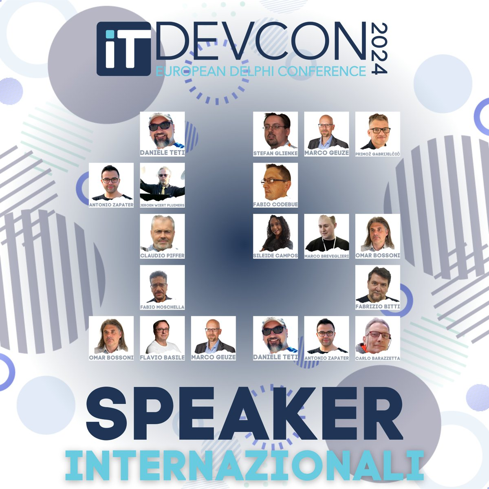

# IT DevCon 2024

The [IT DevCon 2024](https://www.itdevcon.it/roma/en/speakers/) European Delphi Conference will be held on 20241114 and 20241115 in Rome, Italy.

Like always, the link to the conference start page will point to different content each time the conference is organised, so make sure that if you want to access 2024 materials at a later point in time, then start at the Wayback Machine archived links starting at [Wayback to ITDevCon2024](https://web.archive.org/web/20241108175924/https://www.itdevcon.it/roma/en/).

Some important links:

- [Schedule of day 1: 20241114](https://www.itdevcon.it/roma/en/schedule/#day_2024-11-14)
- [Schedule of day 2: 20241115](https://www.itdevcon.it/roma/en/schedule/#day_2024-11-15)
- [Speakers: 15 total, see image below](https://www.itdevcon.it/roma/en/speakers/)
- [Buying tickets](https://shop.bittimesoftware.it/home/27-itdevcon-2024-ticket.html)
- [Conference location information (including where you can stay)](https://www.itdevcon.it/roma/en/info/)

## Links to me and my sessions

- [My speaker profile](./itdevcon2024.md)
- [Materials for session 1 on Tursday 20241114: If you thought you could do multi-threading, then play “The Deadlock Empire” games](./delphi_deadlock_empire/delphi_deadlock_empire.md)
- [Materials for session 2 on Friday 20241114: Hidden Gems of Delphi Language: Operator Overloading and Class/Record helpers](./delphi_language_hidden_gems/delphi_language_hidden_gems.md)
  
(right now the last two links above point to nothing, but they will point to session abstracts shortly, and they will point to something useful after the conference, maybe even during the conference)

